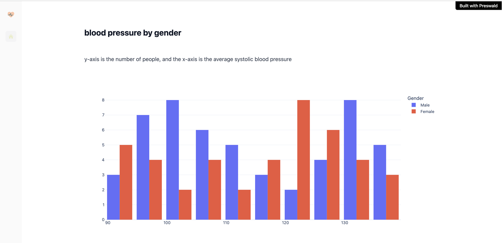

# signl - overview
I'd like to create a web app that visually highlights common lifestyle 
patterns among people with heart disease to support healthcare professionals
make better decisions.

**my initial thoughts**
My initial observation suggested that there may be a higher number of older men 
with lower heart rates who also have heart disease. I wanted to explore possible 
correlations & characteristics shared by people with heart disease.

But I also noticed that many individuals, both male and female, 
who appear active, sleep well, and have normal heart rates are still 
represented in the heart disease group.

This shows me that the patterns aren’t always obvious, and to avoid introducing 
bias, it's better to highlight what the data presents rather than trying to 
draw assumptions or force correlations.

### dataset
I've found my data set on Kaggle - Health & Lifestyle [dataset](https://www.kaggle.com/datasets/mahdimashayekhi/health-and-lifestyle-dataset/data)
**focused data points**
- Gender
- Age
- Hours_of_Sleep
- Heart_Rate
- Blood_Pressure
- Diabetic
- Heart_Disease
**my target is heart-disease**

### how will I implement, what graphs will I show?
- show gender difference (pie chart)
- show blood pressure age + gender (plot)
- sleep + heart rate (plot)
- diabetic + non diabetic (pie chart)

### dashboard images

